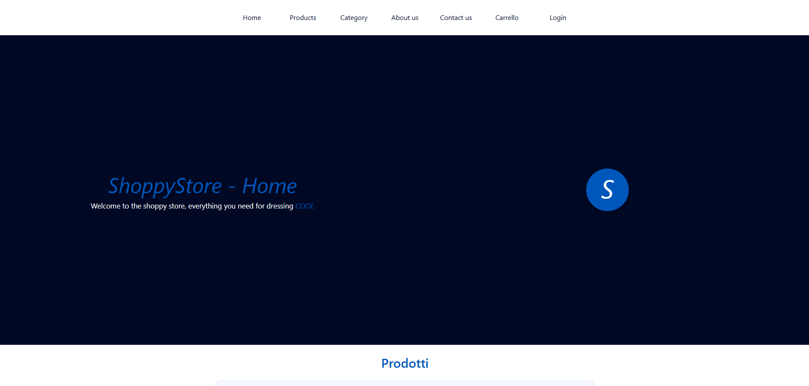
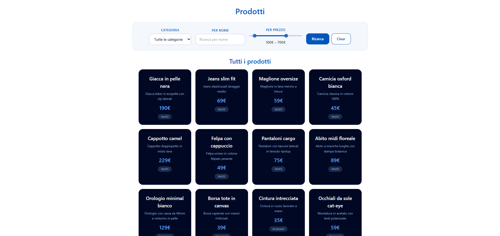
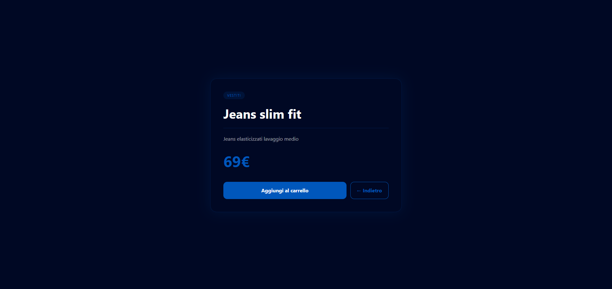
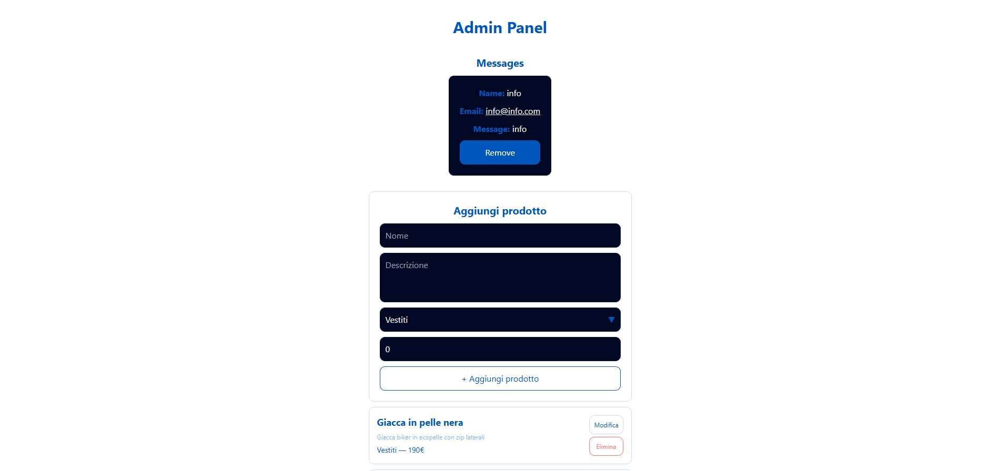

# E-Commerce Store

Questo progetto è un e-commerce frontend sviluppato come esercitazione avanzata di React.  
Implementa gestione utenti, carrello per singolo utente e un sistema admin simulato, utilizzando JSON Server come backend fittizio.

## Pagine

- Home
- Products
- Product detail (dynamic page)
- Categories
- About us
- Contact us
- Cart
- Login / Register
- Admin panel (solo admin)

## Tecnologie

- React
- TypeScript
- Redux Toolkit
- React Router
- Tailwind CSS
- Vite
- JSON Server
- React Toastify

## Architettura

La cartella `src/` è organizzata in:

- `components`: componenti riutilizzabili (Navbar, Footer, Header)
- `pages`: tutte le pagine dell’app
- `dynamic`: pagina prodotto dinamica
- `store`: Redux store con slice:
  - cart (carrello per utente)
  - log (autenticazione simulata)
  - products (API calls con createAsyncThunk)
- `types`: tipizzazioni TypeScript

## Carrello

- Carrello separato per utente loggato
- Ogni utente ha il proprio carrello basato sull’email
- Aggiunta e rimozione prodotti tramite Redux Toolkit

## Autenticazione

- Login e registrazione simulati tramite JSON Server
- Sistema auth frontend-only
- Gestione ruolo admin per accesso alla dashboard

## Admin Panel

- Aggiunta prodotti
- Modifica prodotti
- Eliminazione prodotti
- Visualizzazione messaggi contatti
- Accesso protetto (solo admin)

## Contact Form

- Invio messaggi salvati su JSON Server
- Visualizzazione nella dashboard admin

## API

Le chiamate API sono gestite con `createAsyncThunk` per:

- recupero prodotti
- aggiunta prodotti
- modifica prodotti
- eliminazione prodotti
- registrazione utente
- login utente

## ENDPOINT

- http://localhost:3001/prodotti -> per i prodotti
- http://localhost:3001/utenti -> per gli utenti

## Features

- Filtri prodotti
- Dynamic product page
- Carrello per utente
- Admin panel completo
- Auth simulata
- Toast notifications
- Integrazione JSON Server

## Preview









## Installazione

```bash
git clone https://github.com/MattiaDV/FRONTEND-EXAM.git
cd final_exam
npm install
json-server --watch db.json --port 3001
npm run dev
```

# Perché questo progetto? 

Questo è il mio esame universitario di frontend developing, ho scelto l'e-commerce perché secondo me è quello che mi avrebbe aiutato a inserire tutte le cose richieste nel compito ed era anche quello che mi dava più idee per features da inserire come ad esempio, molto banalmente, i filtri per i prodotti.